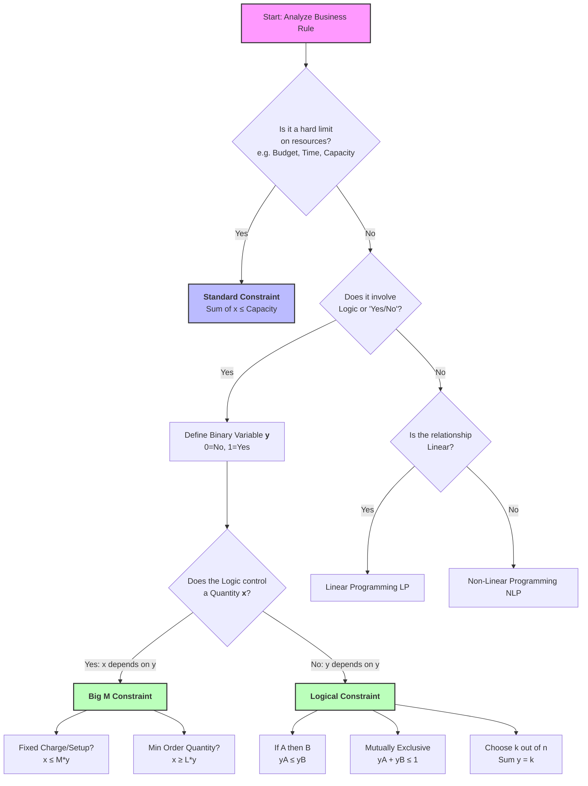

### 1. Decision Dependencies (Binary-to-Binary)
*Use these when modeling relationships between "Yes/No" decisions (e.g., Project A vs. Project B).*

| Business Logic                  | Description                                            | Constraint Formula      |
| ------------------------------- | ------------------------------------------------------ | ----------------------- |
| **Dependency** | If A is selected, then B **must** be selected.         | $`y_A ≤ y_B`$            |
| **Conflict (Mutually Exclusive)**| Select A **OR** B (or neither), but **not both**.      | $`y_A + y_B ≤ 1`$        |
| **At Least One** | You must select A, B, or both.                         | $`y_A + y_B ≥ 1`$        |
| **Co-requisite** | A and B must be taken **together** (or neither).       | $`y_A = y_B`$             |
| **Exclusionary Dependency** | If A is selected, then B **cannot** be selected.       | $`y_A + y_B ≤ 1`$        |
| **k-out-of-n** | Select exactly *k* options from set *N*.               | $`∑(y_i) = k`$          |
| **At most k** | Select no more than *k* options from set *N*.          | $`∑(y_i) ≤ k`$         |

---

### 2. Linking Constraints ("Big M" Logic)
*Use these when a "Yes/No" decision (y) controls a continuous quantity (x).*

| Business Logic                  | Description                                            | Constraint Formula                   |
| ------------------------------- | ------------------------------------------------------ | ------------------------------------ |
| **Fixed Charge / Setup** | If production `x > 0`, pay fixed cost (activate `y=1`).| $`x ≤ M * y`$                         |
| **Minimum Order** | If `x > 0`, it must be at least *L* units.             | $`x ≥ L * y`$   $`x ≤ M * y`$       |
| **Conditional Constraint** | If logical condition `y=1` is true, enforce $`f(x) ≤ 0`$.| $`f(x) ≤ M * (1 - y)`$                |
| **Either-Or** | Enforce **either** Constraint A **OR** Constraint B.   | $`f(x) ≤ M*y`   `g(x) ≤ M*(1-y)`$ |

---

### 3. Decision Tree for Formulation

# Integer Programming Decision Tree

